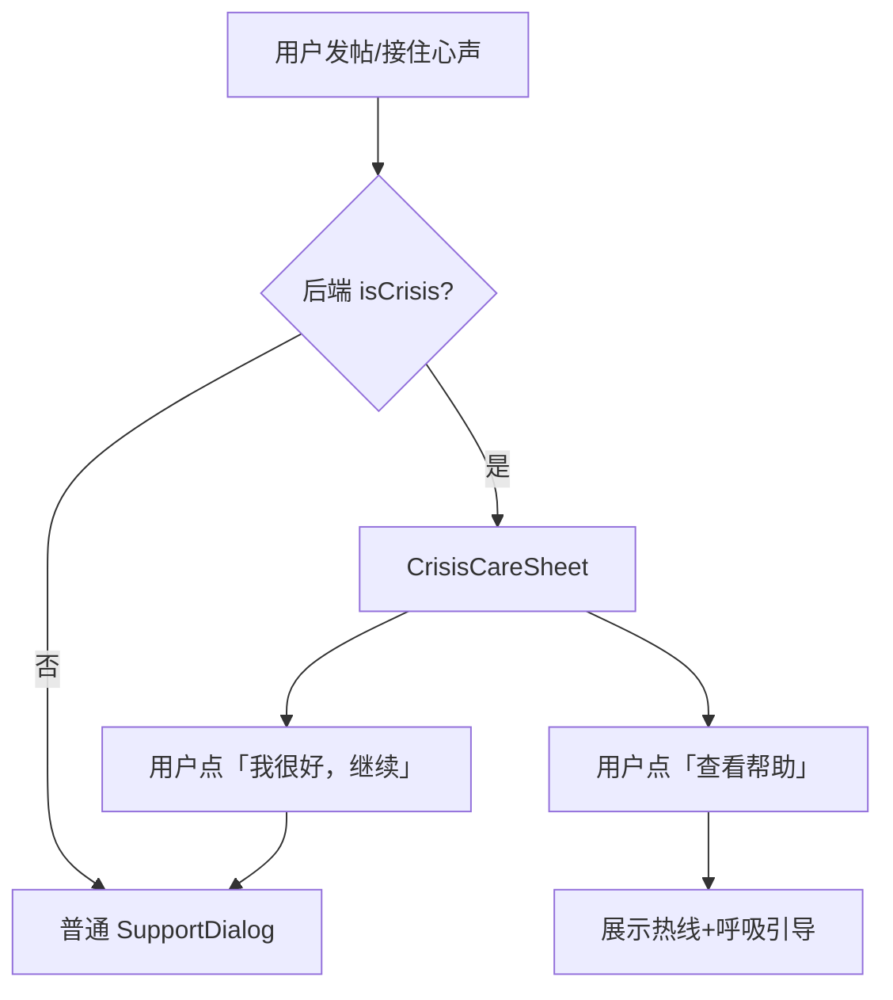

# MoodWalls 终期开发文档 · 人文关怀功能专项

| 项目 | 说明 |
|------|------|
| 文档版本 | V5.0（终期 / 答辩演示） |
| 状态 | **已选定功能，待开发** |
| 开发窗口 | 约 1.5 周 |
| 前置基线 | 二次开发主体已完成（心墙、评论、搜索、动画、深色模式、静态地图等） |
| **核心目标** | 答辩/路演时展示 **有温度、有连接、有叙事** 的校园心灵墙 |
| 技术栈 | HarmonyOS ArkTS + Spring Boot 3.2 + MySQL 8 |
| 选定功能 | **7 项**（见 §1.3） |
| 接口增量 | **8 个新接口** + **2 个既有接口扩展** |

---

## 1. 文档概述

### 1.1 文档目的

本文档在 `PRD.md` / `PRD-二次开发.md` 基线之上，对团队**已选定**的 7 项人文关怀功能给出完整的产品需求与实现规格，包括：

- 功能边界与用户价值（为什么做）
- 业务规则与交互流程
- 前后端接口规范（Request / Response 示例）
- 数据库变更
- 前端文件改造清单与实现要点
- 验收用例

### 1.2 当前实现状态（与本专项相关）

| 维度 | 现状 |
|------|------|
| **点赞** | `POST /api/posts/{id}/like` 已实现；`PostCard` 为单一点赞按钮 |
| **评论** | `GET/POST/DELETE /api/posts/{id}/comments` 已实现；`comment_type` 字段已入库，创建时支持 `resonance` / `whisper` |
| **悄悄话可见性** | ⚠️ **未实现**：列表接口尚未按身份过滤 whisper 评论 |
| **情绪反应** | `post_reactions` 表已在 `init.sql` 定义；**后端接口与前端 UI 均未实现** |
| **AI 危机检测** | `AiService.detectCrisis()` 已实现，`isCrisis` 已写入 `ai_interactions` 并随 support 接口返回 |
| **危机关怀 UI** | ⚠️ **未实现**：`SupportDialog` 未处理 `isCrisis`，无援助资源页 |
| **地图** | `GET /api/map/zones`、`/zones/{key}/posts` 已实现；点击热点直接进帖子 Sheet |
| **走过情绪** | `GET /api/posts/mood-stats?period=today\|week\|month` 已实现；`ProfileTab` 为横向进度条 |
| **送云动画** | 未实现 |
| **陌生人小纸条** | 未实现 |

### 1.3 选定功能总览

| 编号 | 功能名称 | 模块归属 | 优先级 | 预估工时 |
|------|----------|----------|--------|----------|
| **D01** | 情绪反应（抱抱等） | 内容与互动 | P0 | 2d |
| **D02** | 悄悄话评论 | 内容与互动 | P0 | 1.5d |
| **D06** | 帖子「送一朵云」动画 | 内容与互动 | P1 | 1d |
| **H02** | 温柔危机关怀 | 人文关怀 | P0 | 1.5d |
| **H05** | 陌生人的小纸条 | 人文关怀 | P1 | 1.5d |
| **V02** | 区域情绪故事卡 | 可视化叙事 | P0 | 1d |
| **V03** | 情绪曲线图 | 可视化叙事 | P1 | 1.5d |

**合计**：约 **10 人日**（2 前端 + 1 后端可并行完成）。

### 1.4 演示叙事线（8 分钟）

| 时间 | 动作 | 对应功能 |
|------|------|----------|
| 0:30 | 点地图图书馆热点 → 先看区域故事卡 → 再浏览帖子 | V02 |
| 1:30 | 刷心墙，对低落帖「抱抱」；对他人帖送一朵云 | D01、D06 |
| 3:00 | 进入帖子详情，发一条「悄悄话」安慰帖主 | D02 |
| 4:00 | 发一条含低落关键词的帖 → AI 回信 + 危机关怀弹层 | H02 |
| 5:00 | 我的页抽一张陌生人小纸条 | H05 |
| 6:00 | 我的页查看 7 日情绪曲线 | V03 |

---

## 2. 全局约定（继承 PRD.md）

### 2.1 接口基础

| 项目 | 规范 |
|------|------|
| Base URL | `http://<局域网IP>:8080/api` |
| 鉴权 | `Authorization: Bearer <token>`（本专项全部接口需登录，除地图 zones 只读接口） |
| 统一响应 | `{ "code": 200, "message": "success", "data": { ... } }` |
| 分页 | `page` 从 1 开始，`size` 默认 20，最大 50 |

### 2.2 情绪枚举

与 `PRD.md` §3.3 一致：`happy` / `calm` / `moved` / `tired` / `anxious` / `sad` / `angry` / `lonely`。

### 2.3 人文文案基调

- 用「你」而不是「用户」；用「陪伴」而不是「监控」。
- 避免「异常」「违规」，改用「我们注意到你可能很难受」。
- 所有危机相关文案须附带：**本产品不能替代专业心理咨询**。

---

## 3. D01 · 情绪反应（抱抱等）

### 3.1 功能描述

将单一的「点赞」升级为 **5 种有情感语义的反应**，让用户表达「我懂你」「抱抱你」而非冷冰冰的数字 +1。反应数据在帖子卡片与详情页展示，支持查看各类型数量与「我的反应」状态。

**用户价值**：互动更有温度，演示时评委能直观感受到「这不是普通论坛」。

### 3.2 业务规则

| 规则 | 说明 |
|------|------|
| 反应类型 | 固定 5 种，见下表 |
| 唯一性 | 同一用户对同一帖子 **同时只能有 1 种反应** |
| 切换 | 再次选择其他类型视为 **切换**，非叠加 |
| 取消 | 再次点击当前已选类型，或调用 DELETE 接口，取消反应 |
| 与点赞关系 | **保留原点赞接口**（向后兼容），但卡片主操作区以情绪反应为主；点赞数可继续展示或逐步弱化 |
| 自己的帖 | 可以对自己的帖反应（自我鼓励场景） |
| 私密帖 | 他人不可见私密帖，故不可对他人私密帖反应 |

#### 反应类型枚举

| reactionType | 展示文案 | 图标建议 | 适用场景 |
|--------------|----------|----------|----------|
| `hug` | 抱抱 | 🤗 | 低落、孤单、需要安慰 |
| `understand` | 懂你 | 💭 | 焦虑、疲惫、被理解 |
| `cheer` | 加油 | 💪 | 考试周、压力、需要打气 |
| `happy_for_you` | 为你开心 | 🎉 | 开心、感动、分享喜悦 |
| `with_you` | 陪你 | 🤝 | 生气、孤独、需要陪伴 |

### 3.3 接口规范

#### 3.3.1 提交/切换情绪反应 ⬜

```
POST /api/posts/{id}/react
Header: Authorization: Bearer <token>
```

**Request**

```json
{ "reactionType": "hug" }
```

**Response.data**

```json
{
  "totalReactions": 19,
  "myReaction": "hug",
  "reactionStats": {
    "hug": 8,
    "understand": 4,
    "cheer": 3,
    "happy_for_you": 2,
    "with_you": 2
  }
}
```

**错误码**

| code | 场景 |
|------|------|
| 400 | `reactionType` 非法 |
| 404 | 帖子不存在 |
| 403 | 私密帖且非作者 |

#### 3.3.2 取消情绪反应 ⬜

```
DELETE /api/posts/{id}/react
Header: Authorization: Bearer <token>
```

**Response.data**

```json
{
  "totalReactions": 18,
  "myReaction": null,
  "reactionStats": {
    "hug": 7,
    "understand": 4,
    "cheer": 3,
    "happy_for_you": 2,
    "with_you": 2
  }
}
```

#### 3.3.3 帖子列表/详情携带反应摘要 ⬜

在既有 `GET /api/posts`、`GET /api/posts/{id}` 的每条帖子对象中 **扩展字段**：

```json
{
  "id": 1,
  "likes": 34,
  "isLiked": false,
  "totalReactions": 19,
  "myReaction": "hug",
  "topReactions": [
    { "type": "hug", "label": "抱抱", "count": 8 },
    { "type": "understand", "label": "懂你", "count": 4 }
  ],
  "reactionStats": {
    "hug": 8,
    "understand": 4,
    "cheer": 3,
    "happy_for_you": 2,
    "with_you": 2
  }
}
```

> `topReactions`：按 count 降序取前 2 项，供卡片一行展示。

### 3.4 数据库

表已存在于 `backend/sql/init.sql`：

```sql
CREATE TABLE IF NOT EXISTS post_reactions (
  id            BIGINT      NOT NULL AUTO_INCREMENT,
  user_id       BIGINT      NOT NULL,
  post_id       BIGINT      NOT NULL,
  reaction_type VARCHAR(32) NOT NULL COMMENT 'hug/understand/cheer/happy_for_you/with_you',
  created_at    DATETIME(6) NOT NULL DEFAULT CURRENT_TIMESTAMP(6),
  updated_at    DATETIME(6) NOT NULL DEFAULT CURRENT_TIMESTAMP(6) ON UPDATE CURRENT_TIMESTAMP(6),
  PRIMARY KEY (id),
  UNIQUE KEY uk_post_reactions_user_post (user_id, post_id),
  ...
);
```

**后端待建**：`PostReaction` 实体、`PostReactionRepository`、`ReactionService`、`ReactionController`（或在 `PostController` 中扩展）。

### 3.5 前端实现

| 文件 | 改造内容 |
|------|----------|
| `model/MoodWallTypes.ets` | 新增 `ReactionType`、`ReactionStat`、`PostReactionSummary`；`NoteItem` 扩展反应字段 |
| `service/PostApi.ets` | 新增 `reactPost(id, type)`、`cancelReact(id)` |
| `components/ReactionBar.ets` | **新建**：横向 5 按钮 + 选中高亮 + 数量气泡 |
| `components/PostCard.ets` | 操作区：`buildLikeAction` 改为 `ReactionBar` 或在其下方展示 Top2 反应摘要 |
| `pages/PostDetailPage.ets` | 详情页完整 `ReactionBar` |
| `tabs/FeedTab.ets` | `handleReact` 回调，乐观更新 + 失败回滚 |

**交互细节**

1. 点击反应按钮 → 乐观更新 UI → 调接口 → 失败 toast 并回滚。
2. 已选中类型再次点击 → 调 DELETE 取消。
3. 卡片默认展示 Top2 反应（如「🤗 抱抱 8 · 💭 懂你 4」），点击展开完整面板（ActionSheet 或底部条）。
4. 未登录点击 → toast「请先登录后再表达心意」。

### 3.6 验收标准

| 编号 | 步骤 | 期望 |
|------|------|------|
| D01-E01 | 账号 A 对帖子点「抱抱」 | 数字 +1，`myReaction=hug` 高亮 |
| D01-E02 | 再点「加油」 | 抱抱 -1，加油 +1，总数不变 |
| D01-E03 | 再点「加油」取消 | `myReaction=null`，加油数 -1 |
| D01-E04 | 刷新 Feed | 反应状态与数量与服务端一致 |
| D01-E05 | 账号 B 看同一帖 | 看到 Top 反应，自己的 `myReaction` 独立 |

---

## 4. D02 · 悄悄话评论

### 4.1 功能描述

在公开「共鸣评论」之外，增加 **悄悄话** 模式：评论内容 **仅帖子作者与评论者本人可见**，其他用户（含其他评论者）在列表中看不到该条。用于「想安慰 TA 但不想公开说」的场景。

**用户价值**：树洞式陪伴，强调隐私与温柔，答辩时可演示双账号对比。

### 4.2 业务规则

| 规则 | 说明 |
|------|------|
| 类型 | `resonance`（公开共鸣，默认） / `whisper`（悄悄话） |
| 可见性 | whisper：**仅帖主 + 评论者**；resonance：所有人可见 |
| 回复 | 悄悄话 **不支持楼中楼回复**（仅一级评论）；若对 resonance 回复，继承公开属性 |
| 通知 | 悄悄话仍通知帖主，但通知文案为「有人给你留了一句悄悄话」，**不展示评论正文** |
| 字数 | 1~200 字，走 `ContentModerator` 审核 |
| 删除 | 评论者可删自己的；帖主可删自己帖下任意评论（含悄悄话） |
| 计数 | `post.commentCount` 统计 **仅 resonance**；whisper **不计入公开评论数**（或单独字段 `whisperCount` 仅帖主可见） |

### 4.3 接口规范

#### 4.3.1 发布评论（扩展） 🔄

```
POST /api/posts/{id}/comments
Header: Authorization: Bearer <token>
```

**Request**

```json
{
  "content": "今晚别太熬了，你已经很棒了。",
  "commentType": "whisper"
}
```

**Response.data**：同既有 `CommentDto`，含 `commentType: "whisper"`。

#### 4.3.2 评论列表（扩展过滤逻辑） 🔄

```
GET /api/posts/{id}/comments?page=1&size=20
Header: Authorization: Bearer <token>（强烈建议登录，否则无法正确过滤 whisper）
```

**后端过滤规则（`CommentService.getComments` 须新增）**

```
对每条 comment：
  if commentType == 'whisper':
    if currentUserId == post.userId OR currentUserId == comment.userId:
      返回该条
    else:
      不返回
  else:
    返回该条
```

**Response.data.list 项扩展**

```json
{
  "id": 101,
  "content": "今晚别太熬了...",
  "commentType": "whisper",
  "isWhisper": true,
  "authorNickname": "星夜",
  "mine": false,
  "canDelete": true,
  "createdAt": "2026-06-02T14:02:00",
  "timeText": "3 分钟前"
}
```

#### 4.3.3 帖主悄悄话数量（可选） ⬜

```
GET /api/posts/{id}/whisper-count
Header: Authorization: Bearer <token>（仅帖主）
```

**Response.data**

```json
{ "whisperCount": 3 }
```

> 用于帖主在详情页看到「你有 3 条悄悄话」提示，不暴露内容给外人。

### 4.4 数据库

`post_comments.comment_type` 已存在，无需 ALTER。可选扩展：

```sql
-- 若将 whisper 从 commentCount 剥离，posts 表可增加：
ALTER TABLE posts ADD COLUMN whisper_count INT NOT NULL DEFAULT 0 COMMENT '悄悄话数量（仅作者可见统计）';
```

### 4.5 前端实现

| 文件 | 改造内容 |
|------|----------|
| `pages/PostDetailPage.ets` | 评论输入区上方增加 Tab：**公开共鸣** / **悄悄话**；`sendComment()` 根据 Tab 设置 `commentType` |
| `pages/PostDetailPage.ets` | whisper 评论行左侧加 🔒 角标 + 浅紫背景 `#F5F0FF` |
| `pages/PostDetailPage.ets` | 帖主可见顶部横幅：「收到了 N 条悄悄话」 |
| `model/MoodWallTypes.ets` | `CommentItem` 增加 `isWhisper?: boolean` |
| `service/CommentApi.ets` | 创建评论时传 `commentType`（已支持则仅联调） |

**交互文案**

| 场景 | 文案 |
|------|------|
| 切换到悄悄话 | placeholder：「这句话只有 TA 能看到，像轻轻拍了一下肩膀。」 |
| 发送成功 | toast：「悄悄话已送达」 |
| 非帖主看到列表 | 无 whisper 条目，界面与现有一致 |

**演示脚本**：账号 A 发帖 → 账号 B 发悄悄话 → A 可见 B 不可见其他 whisper → C 看不到 B 的悄悄话。

### 4.6 验收标准

| 编号 | 步骤 | 期望 |
|------|------|------|
| D02-E01 | B 对 A 的帖发 whisper | A 收到通知，标题含「悄悄话」 |
| D02-E02 | C 查看同帖评论列表 | 看不到 B 的 whisper |
| D02-E03 | B 查看自己发的 whisper | 可见，带 🔒 样式 |
| D02-E04 | A 删除 B 的 whisper | 双方列表均消失 |
| D02-E05 | 发 resonance | 所有人可见，计入评论数 |

---

## 5. D06 · 帖子「送一朵云」动画

### 5.1 功能描述

对他人帖子发送 **轻量级纯前端动画反馈**：一朵小云从卡片缓缓升起并消散，表达「轻轻托你一下」的陪伴感。 **不持久化、不计数**，强调仪式感而非社交压力。

**用户价值**：演示视觉冲击力强，技术实现轻量，与人文主题契合。

### 5.2 业务规则

| 规则 | 说明 |
|------|------|
| 触发 | 长按帖子卡片，或点击操作区「☁️」按钮 |
| 对象 | **仅他人帖子**；自己的帖不显示入口 |
| 频率 | 同一用户对同一帖 **60 秒内最多 1 次**（`AppStorage` 或 `Preferences` 记录） |
| 并发 | 动画播放中忽略重复触发 |
| 后端 | **无需接口**；可选 P2 埋点 |
| 与反应关系 | 独立于 D01，可同时存在 |

### 5.3 前端实现

| 文件 | 改造内容 |
|------|----------|
| `components/CloudGiftAnimation.ets` | **新建**：`@Component` 接收 `triggerId`，播放云朵上升 + 透明度动画 |
| `components/PostCard.ets` | 操作区增加「☁️」按钮；`Stack` 顶层挂载动画组件 |
| `common/CloudGiftThrottle.ets` | **新建**：`canSendCloud(postId)` / `markSent(postId)` |
| `pages/PostDetailPage.ets` | 可选：详情页同样支持 |

**动画规格（ArkUI `animateTo`）**

```
时长：1200ms
曲线：Curve.EaseOut
阶段：
  0ms   — 云朵 scale 0.6, opacity 0, translateY 0
  200ms — opacity 1, scale 1
  800ms — translateY -80vp, opacity 0.8
  1200ms — translateY -120vp, opacity 0, 组件销毁
视觉：白色圆角云形 Column + 淡蓝阴影，可选 2~3 个小圆拼接
```

**可选增强**：动画结束瞬间 toast「一朵云送给了 TA」。

### 5.4 验收标准

| 编号 | 步骤 | 期望 |
|------|------|------|
| D06-E01 | 对他人帖点 ☁️ | 播放上升动画，约 1.2s 结束 |
| D06-E02 | 60 秒内再次点 | toast「稍后再送吧」，无动画 |
| D06-E03 | 自己帖子 | 无 ☁️ 按钮 |
| D06-E04 | 深色模式 | 云朵与阴影对比度正常 |

---

## 6. H02 · 温柔危机关怀

### 6.1 功能描述

当用户发布或 AI 处理的内容命中 **自伤/极端情绪关键词** 时，不冷冰冰拒绝或仅弹错误，而是弹出 **温柔的关怀层**：确认「我们在意你」、展示校心理中心与热线、提供「我很好，继续」与「查看帮助」分支。

**用户价值**：产品灵魂功能，体现社会责任与人文深度。

### 6.2 业务规则

| 规则 | 说明 |
|------|------|
| 检测时机 | ① 发帖正文 `POST /api/posts`；② AI 回信 `POST /api/posts/{id}/support`；③ 温情周报 `GET /api/profile/weekly-report` |
| 检测实现 | 后端 `AiService.CRISIS_KEYWORDS`（已有）；**发帖须新增** `ContentModerator.detectCrisis(content)` 同步检测 |
| 发帖行为 | 命中后 **仍允许发帖**（不拦截），但响应 `isCrisis: true` |
| AI 行为 | `isCrisis=true` 时 AI 回复追加援助引导句 |
| 前端行为 | `isCrisis=true` 时 **先展示 `CrisisCareSheet`**，用户确认后再展示普通 `SupportDialog` 或关闭 |
| 记录 | `ai_interactions.is_crisis=1`（已有） |
| 免责 | 弹层底部固定：「本产品不能替代专业心理咨询。如有危险，请立即联系身边人或拨打下方热线。」 |

#### 危机关键词（与后端保持一致，可扩展）

```
不想活了、自杀、自残、自伤、结束生命、活不下去、想死、割腕、跳楼、没人在乎我
```

### 6.3 接口规范

#### 6.3.1 发帖响应扩展 🔄

`POST /api/posts` 的 `data` 增加：

```json
{
  "post": { "id": 42, "...": "..." },
  "aiResponse": "难过的时候也值得被接住...",
  "isCrisis": true
}
```

#### 6.3.2 接住心声（已有，前端需消费） ✅

```
POST /api/posts/{id}/support
```

**Response.data**

```json
{
  "response": "我听到你了。你值得被好好对待...",
  "isCrisis": true
}
```

#### 6.3.3 危机援助资源 ⬜

```
GET /api/resources/crisis
```

**Response.data**

```json
{
  "title": "你不必一个人扛",
  "subtitle": "如果你正经历很难的时刻，这些资源可以帮到你",
  "items": [
    {
      "name": "全国心理援助热线",
      "phone": "400-161-9995",
      "hours": "24 小时",
      "action": "tel"
    },
    {
      "name": "本校心理健康教育中心",
      "phone": "0731-88888888",
      "hours": "工作日 8:30-17:00",
      "action": "tel"
    },
    {
      "name": "中南大学心理咨询预约",
      "url": "https://example.edu/psych",
      "action": "link"
    }
  ],
  "breathingGuide": {
    "title": "先和我一起呼吸 60 秒",
    "steps": ["吸气 4 秒", "屏息 4 秒", "呼气 6 秒"]
  }
}
```

> 资源列表可硬编码在 `CrisisResourceService`，后续改配置表。

### 6.4 数据库

无需新表。可选：

```sql
CREATE TABLE IF NOT EXISTS crisis_resource_clicks (
  id BIGINT PRIMARY KEY AUTO_INCREMENT,
  user_id BIGINT NOT NULL,
  resource_name VARCHAR(64) NOT NULL,
  created_at DATETIME(6) DEFAULT CURRENT_TIMESTAMP(6)
);
```

### 6.5 前端实现

| 文件 | 改造内容 |
|------|----------|
| `components/CrisisCareSheet.ets` | **新建**：半屏 Sheet，温暖配色、热线列表、呼吸引导入口、「我很好」关闭 |
| `components/SupportDialog.ets` | 增加 `@Prop isCrisis: boolean`；危机时在正文下展示简短援助提示 |
| `components/BreathingGuide.ets` | **新建**（可选）：60 秒呼吸引导动画 |
| `pages/Index.ets` | 发帖成功回调：`if (isCrisis) showCrisisSheet()` 再决定是否开 SupportDialog |
| `pages/PostDetailPage.ets` | `supportPost` 返回 `isCrisis` 时同样触发 |
| `service/ResourceApi.ets` | **新建**：`getCrisisResources()` |
| `tabs/PostTab.ets` | 发帖前本地预检关键词（可选），提前温和提示 |

**交互流程**



### 6.6 验收标准

| 编号 | 步骤 | 期望 |
|------|------|------|
| H02-E01 | 发含「不想活了」的帖 | 发帖成功 + 弹出 CrisisCareSheet |
| H02-E02 | 点热线 | 调起系统拨号（或复制号码） |
| H02-E03 | 点「我很好」 | 关闭关怀层，可继续浏览 |
| H02-E04 | 正常发帖 | 不弹关怀层 |
| H02-E05 | 接住心声命中危机 | 同样触发关怀层 |

---

## 7. H05 · 陌生人的小纸条

### 7.1 功能描述

用户每日可 **抽取 1 条** 来自校园他人的公开正能量摘句（脱敏匿名），配文案「今天也有陌生人在为你加油」。强化「匿名但温暖」的连接感。

### 7.2 业务规则

| 规则 | 说明 |
|------|------|
| 频次 | 每用户每自然日 **1 次**（按 `Asia/Shanghai` 0 点重置） |
| 来源 | 从 `posts` 中筛选：`status=1`、`visibility=1`（公开）、`mood IN (happy, calm, moved)`、字数 ≥ 15 |
| 排除 | 不抽取 **自己的帖**；不抽取含辱骂/危机关键词的帖 |
| 展示 | 仅展示 **摘句**（最多 80 字）+ 情绪标签 + 「来自校园陌生人」；**不展示**昵称、头像、帖子 ID |
| 重复 | 同一用户 7 天内不重复同一条 `post_id` |
| 空库 | 返回内置 5 条种子暖心句 |

### 7.3 接口规范

#### 7.3.1 抽取小纸条 ⬜

```
POST /api/inspiration/draw
Header: Authorization: Bearer <token>
```

**Response.data（成功）**

```json
{
  "content": "今天图书馆的晚霞很好看，希望你也能抬头看一眼。",
  "mood": "calm",
  "moodLabel": "平静",
  "moodColor": "#73C088",
  "source": "campus",
  "drawnAt": "2026-06-05T20:15:00",
  "remainingToday": 0
}
```

**Response.data（今日已抽）**

```json
{
  "alreadyDrawn": true,
  "content": "今天图书馆的晚霞很好看...",
  "mood": "calm",
  "moodLabel": "平静",
  "drawnAt": "2026-06-05T09:30:00",
  "remainingToday": 0
}
```

**错误码**

| code | 场景 |
|------|------|
| 401 | 未登录 |

#### 7.3.2 查询今日是否已抽（可选） ⬜

```
GET /api/inspiration/today
Header: Authorization: Bearer <token>
```

### 7.4 数据库

```sql
CREATE TABLE IF NOT EXISTS inspiration_draws (
  id         BIGINT      NOT NULL AUTO_INCREMENT,
  user_id    BIGINT      NOT NULL,
  post_id    BIGINT      DEFAULT NULL COMMENT '来源帖子，种子句为空',
  content    VARCHAR(200) NOT NULL COMMENT '展示摘句快照',
  mood       VARCHAR(16) DEFAULT NULL,
  draw_date  DATE        NOT NULL COMMENT '抽取日期（上海时区）',
  created_at DATETIME(6) NOT NULL DEFAULT CURRENT_TIMESTAMP(6),
  PRIMARY KEY (id),
  UNIQUE KEY uk_inspiration_user_date (user_id, draw_date),
  KEY idx_inspiration_user_post (user_id, post_id),
  CONSTRAINT fk_inspiration_user FOREIGN KEY (user_id) REFERENCES users (id)
) ENGINE=InnoDB DEFAULT CHARSET=utf8mb4 COMMENT='每日小纸条抽取记录';
```

### 7.5 前端实现

| 文件 | 改造内容 |
|------|----------|
| `components/InspirationCard.ets` | **新建**：纸条卡片 UI（折纸风格、情绪色条） |
| `tabs/ProfileTab.ets` | 「走过的情绪」区块上方或下方增加「今日小纸条」入口 |
| `service/InspirationApi.ets` | **新建**：`draw()` / `getToday()` |
| `pages/InspirationPage.ets` | **新建**（可选）：全屏抽纸条动画页 |

**交互**

1. 进入我的页 → 显示「抽一张陌生人的小纸条」按钮。
2. 点击 → Loading「正在寻找校园里的温暖...」→ 翻转动画展示摘句。
3. 今日已抽 → 直接展示已抽内容，按钮文案改为「今日已领取」。

**文案**

| 场景 | 文案 |
|------|------|
| 抽取前 | 「今天校园里的某个陌生人，想对你说一句话。」 |
| 抽取后 | 「收好这张小纸条吧。」 |

### 7.6 验收标准

| 编号 | 步骤 | 期望 |
|------|------|------|
| H05-E01 | 首次点击抽取 | 展示一条正能量摘句 |
| H05-E02 | 同日再次进入 | 显示已抽内容，不可再抽 |
| H05-E03 | 次日再抽 | 可抽新条，且不重复近 7 日内容 |
| H05-E04 | 库内无符合条件帖子 | 展示内置种子句 |
| H05-E05 | 摘句无昵称/头像 | 完全匿名 |

---

## 8. V02 · 区域情绪故事卡

### 8.1 功能描述

用户点击地图热点时， **先弹出半屏「区域情绪故事卡」**（叙事文案 + 数据摘要），再提供「看看这里的帖子」进入既有帖子列表 Sheet。把冷冰冰的统计变成 **有温度的校园角落故事**。

### 8.2 业务规则

| 规则 | 说明 |
|------|------|
| 数据窗口 | 近 **24 小时** 内该 `zone_key` 的帖子 |
| 故事生成 | 服务端模板拼接：区域名 + 主导情绪 + 帖子数 + 鼓励句 |
| 空区域 | 帖子数为 0 时展示邀请文案，仍可「去写一张纸条」 |
| 层级 | 故事卡 →（用户点击）→ 区域帖子 Sheet（现有） |
| 与地图 | 依赖 `CampusMapConfig.ets` 热点坐标 + `GET /api/map/zones` |

#### 故事模板示例

| 条件 | 故事文案模板 |
|------|--------------|
| postCount > 0 且 dominantMood = anxious | 「今天的{title}有些紧绷，{count} 位同学在这里留下了心情。焦虑偏多，但也有人正在互相打气。」 |
| postCount > 0 且 dominantMood = calm | 「今天的{title}比较安静，{count} 条心情里，平静是主旋律。适合慢下来走一走。」 |
| postCount = 0 | 「今天的{title}还很安静。如果你正好路过，可以留下第一张心情纸条。」 |

### 8.3 接口规范

#### 8.3.1 区域情绪故事 ⬜

```
GET /api/map/zones/{key}/story
```

**Response.data**

```json
{
  "zoneKey": "library",
  "title": "图书馆",
  "subtitle": "橙色压力区",
  "accent": "#F08C62",
  "postCount": 12,
  "dominantMood": "anxious",
  "dominantMoodLabel": "焦虑",
  "moodBreakdown": [
    { "mood": "anxious", "label": "焦虑", "percent": 42, "count": 5 },
    { "mood": "tired", "label": "疲惫", "percent": 33, "count": 4 },
    { "mood": "calm", "label": "平静", "percent": 25, "count": 3 }
  ],
  "story": "今天的图书馆有些紧绷，12 位同学在这里留下了心情。焦虑偏多，但也有人正在互相打气。",
  "encouragement": "期末周会过去的，今晚也值得好好休息。"
}
```

> `moodBreakdown`：供故事卡内展示迷你情绪条；`encouragement`：从预设句库按 dominantMood 随机取一条。

### 8.4 后端实现要点

| 类/方法 | 说明 |
|---------|------|
| `MapController.getZoneStory(key)` | 新增端点 |
| `MapStoryService.buildStory(zone, stats)` | 聚合 `postRepository.countByZoneAndMoodSince` + 模板 |
| 鼓励句库 | 硬编码 `Map<String, List<String>>` 按 mood 分类，各 3~5 句 |

### 8.5 前端实现

| 文件 | 改造内容 |
|------|----------|
| `tabs/MapTab.ets` | 热点 `onClick`：先 `loadZoneStory(key)` → `showStorySheet=true` |
| `components/ZoneStorySheet.ets` | **新建**：半屏故事卡（标题、story 正文、情绪 breakdown、两个按钮） |
| `service/MoodApi.ets` | 新增 `getZoneStory(zoneKey)` |
| `model/MoodWallTypes.ets` | 新增 `ZoneStoryResponse` |

**ZoneStorySheet 按钮**

| 按钮 | 行为 |
|------|------|
| 看看这里的帖子 | 关闭故事卡，打开现有 `zonePosts` Sheet |
| 去写一张纸条 | `onNavigateToPost()` 跳转发帖 Tab |

### 8.6 验收标准

| 编号 | 步骤 | 期望 |
|------|------|------|
| V02-E01 | 点图书馆热点 | 先出故事卡，不是直接出帖子列表 |
| V02-E02 | 故事卡展示 | 含区域名、24h 帖数、主导情绪、叙事句 |
| V02-E03 | 点「看看帖子」 | 进入区域帖子 Sheet |
| V02-E04 | 无帖区域 | 展示邀请文案，可去发帖 |
| V02-E05 | 刷新地图后再点 | 故事随数据更新 |

---

## 9. V03 · 情绪曲线图

### 9.1 功能描述

将个人页「走过的情绪」从 **横向进度条** 升级为 **近 7 日情绪曲线/面积图**，让用户看见自己一周的情绪起伏，形成「成长叙事」。

### 9.2 业务规则

| 规则 | 说明 |
|------|------|
| 范围 | 默认 **近 7 个自然日**（含今天），按 `Asia/Shanghai` |
| 数据口径 | 仅统计 **当前登录用户** 的活跃帖子（`status=1`） |
| 每日指标 | 每日取 **主导情绪**（发帖数最多的 mood）；若当日无帖则为 `null` |
| 多日帖 | 同一天多条帖：按 mood 计数取最多者；并列取「情绪权重」较低者（更需关怀优先：sad > anxious > lonely > tired > angry > moved > calm > happy） |
| 切换 | 保留日/周/月 **进度条视图** 作为 Tab 二；曲线为默认 Tab 一 |
| 空数据 | 7 日全无帖 → 展示插画 +「还没有足够的心情记录，去贴第一张吧」 |

### 9.3 接口规范

#### 9.3.1 情绪曲线 ⬜

```
GET /api/profile/mood-curve?days=7
Header: Authorization: Bearer <token>
```

| 参数 | 类型 | 必填 | 说明 |
|------|------|------|------|
| days | int | 否 | 默认 7，最大 30 |

**Response.data**

```json
{
  "days": 7,
  "points": [
    { "date": "2026-05-30", "weekday": "五", "dominantMood": "anxious", "label": "焦虑", "color": "#F08C62", "postCount": 2 },
    { "date": "2026-05-31", "weekday": "六", "dominantMood": null, "label": null, "color": null, "postCount": 0 },
    { "date": "2026-06-01", "weekday": "日", "dominantMood": "calm", "label": "平静", "color": "#73C088", "postCount": 1 },
    { "date": "2026-06-02", "weekday": "一", "dominantMood": "tired", "label": "疲惫", "color": "#92A0B0", "postCount": 3 },
    { "date": "2026-06-03", "weekday": "二", "dominantMood": "happy", "label": "开心", "color": "#F6C445", "postCount": 1 },
    { "date": "2026-06-04", "weekday": "三", "dominantMood": "moved", "label": "感动", "color": "#B786F7", "postCount": 1 },
    { "date": "2026-06-05", "weekday": "四", "dominantMood": "calm", "label": "平静", "color": "#73C088", "postCount": 2 }
  ],
  "summary": "这一周你经历了起伏，但平静的日子也在慢慢增多。"
}
```

> `summary`：后端按首尾主导情绪差异生成一句温柔总结，或调 AI 生成（P2）。

#### 9.3.2 既有情绪统计（保留） ✅

```
GET /api/posts/mood-stats?period=week
```

用于进度条 Tab，与曲线互补。

### 9.4 数据库

无需新表，查询 `posts` 按 `user_id` + `DATE(created_at)` 聚合。

**Repository 示例 SQL 逻辑**

```sql
SELECT DATE(created_at) AS d, mood, COUNT(*) AS cnt
FROM posts
WHERE user_id = ? AND status = 1 AND created_at >= ?
GROUP BY d, mood
ORDER BY d ASC;
```

### 9.5 前端实现

| 文件 | 改造内容 |
|------|----------|
| `components/MoodCurveChart.ets` | **新建**：Canvas 或 `Polyline` 绘制 7 日曲线；Y 轴为情绪索引（8 档），X 轴为日期 |
| `tabs/ProfileTab.ets` | 「走过的情绪」区增加 Tab：**曲线** / **分布**；曲线调 `ProfileApi.getMoodCurve()` |
| `service/ProfileApi.ets` | 新增 `getMoodCurve(days)` |
| `model/MoodWallTypes.ets` | 新增 `MoodCurvePoint`、`MoodCurveResponse` |

**图表规格**

| 项 | 值 |
|----|-----|
| 高度 | 180vp |
| 有数据点 | 实心圆点 8vp，颜色为 mood color |
| 无数据日 | 断点，不连线 |
| 区域填充 | 主导情绪点下方渐变填充，透明度 0.15 |
| 交互 | 点击某日显示 tooltip：「周三 · 疲惫 · 3 条心情」 |

### 9.6 验收标准

| 编号 | 步骤 | 期望 |
|------|------|------|
| V03-E01 | 7 日内有发帖 | 曲线正确连点，颜色与情绪一致 |
| V03-E02 | 中间某天无帖 | 该日断点，不报错 |
| V03-E03 | 切换「分布」Tab | 显示既有进度条统计 |
| V03-E04 | 新用户无帖 | 空状态插画与文案 |
| V03-E05 | 多日同情绪 | 曲线平稳，summary 合理 |

---

## 10. 接口汇总

| 方法 | 路径 | 功能 | 状态 |
|------|------|------|------|
| POST | `/api/posts/{id}/react` | D01 提交反应 | ⬜ |
| DELETE | `/api/posts/{id}/react` | D01 取消反应 | ⬜ |
| GET | `/api/posts`、`/api/posts/{id}` | D01 扩展反应字段 | ⬜ |
| POST | `/api/posts/{id}/comments` | D02 whisper 类型 | 🔄 |
| GET | `/api/posts/{id}/comments` | D02 whisper 过滤 | 🔄 |
| GET | `/api/posts/{id}/whisper-count` | D02 帖主悄悄话数 | ⬜ 可选 |
| — | — | D06 纯前端 | — |
| POST | `/api/posts` | H02 返回 `isCrisis` | 🔄 |
| POST | `/api/posts/{id}/support` | H02 已有 | ✅ |
| GET | `/api/resources/crisis` | H02 援助资源 | ⬜ |
| POST | `/api/inspiration/draw` | H05 抽小纸条 | ⬜ |
| GET | `/api/inspiration/today` | H05 今日状态 | ⬜ 可选 |
| GET | `/api/map/zones/{key}/story` | V02 区域故事 | ⬜ |
| GET | `/api/profile/mood-curve` | V03 情绪曲线 | ⬜ |

---

## 11. 数据库变更汇总

```sql
-- 已有，无需重复执行
-- post_reactions（D01）
-- post_comments.comment_type（D02）

-- H05 小纸条抽取记录
CREATE TABLE IF NOT EXISTS inspiration_draws ( ... );  -- 见 §7.4

-- D02 可选
-- ALTER TABLE posts ADD COLUMN whisper_count INT NOT NULL DEFAULT 0;

-- H02 可选埋点
-- CREATE TABLE IF NOT EXISTS crisis_resource_clicks ( ... );  -- 见 §6.4
```

所有变更统一提交至 `backend/sql/init.sql`。

---

## 12. 前端文件清单

| 文件 | 功能 | 操作 |
|------|------|------|
| `components/ReactionBar.ets` | D01 | 新建 |
| `components/CloudGiftAnimation.ets` | D06 | 新建 |
| `common/CloudGiftThrottle.ets` | D06 | 新建 |
| `components/CrisisCareSheet.ets` | H02 | 新建 |
| `components/BreathingGuide.ets` | H02 | 新建（可选） |
| `components/InspirationCard.ets` | H05 | 新建 |
| `components/ZoneStorySheet.ets` | V02 | 新建 |
| `components/MoodCurveChart.ets` | V03 | 新建 |
| `components/PostCard.ets` | D01、D06 | 改造 |
| `pages/PostDetailPage.ets` | D01、D02、D06、H02 | 改造 |
| `pages/Index.ets` | H02 | 改造 |
| `tabs/MapTab.ets` | V02 | 改造 |
| `tabs/ProfileTab.ets` | H05、V03 | 改造 |
| `service/PostApi.ets` | D01 | 改造 |
| `service/CommentApi.ets` | D02 | 改造 |
| `service/ResourceApi.ets` | H02 | 新建 |
| `service/InspirationApi.ets` | H05 | 新建 |
| `service/MoodApi.ets` | V02 | 改造 |
| `service/ProfileApi.ets` | V03 | 改造 |
| `model/MoodWallTypes.ets` | 全部 | 扩展类型 |

---

## 13. 开发排期（1.5 周）

| 天 | 后端 | 前端 |
|----|------|------|
| **D1** | D01 ReactionService + Controller；帖子列表扩展字段 | `ReactionBar` + `PostCard` 联调 |
| **D2** | D02 whisper 列表过滤 + 通知文案；whisperCount | `PostDetailPage` 双模式评论 UI |
| **D3** | V02 `MapStoryService`；H02 `CrisisResourceService` + 发帖 isCrisis | `ZoneStorySheet` + `MapTab` 流程改造 |
| **D4** | H05 `InspirationService` + 表；V03 `MoodCurveService` | `CrisisCareSheet` + `Index` 发帖流程 |
| **D5** | 联调修 Bug；`/profile/mood-curve` 边界 | `InspirationCard` + `MoodCurveChart` |
| **D6** | 集成测试 7 项验收用例 | D06 云朵动画；深色模式适配 |
| **D7~D8** | 种子数据（正能量帖 15 条） | 演示脚本彩排、录屏 |

---

## 14. 团队分工建议

| 角色 | 负责功能 |
|------|----------|
| **后端** | D01 反应 API；D02 whisper 过滤；V02 故事；H02 资源 + 发帖危机；H05 抽取；V03 曲线 |
| **前端 A** | D01 ReactionBar；D02 评论 UI；D06 云朵动画 |
| **前端 B** | V02 故事卡；V03 曲线图；H05 小纸条 |
| **前端 C / 全员** | H02 CrisisCareSheet；发帖/接住心声流程串联 |
| **产品/文案** | 故事模板、鼓励句库、危机文案、种子帖、答辩脚本 |

---

## 15. 总验收用例

| 编号 | 功能 | 步骤 | 期望 |
|------|------|------|------|
| **T01** | D01 | 抱抱 → 切换 → 取消 | 数据正确、UI 高亮 |
| **T02** | D02 | 双账号 whisper | 隐私隔离正确 |
| **T03** | D06 | 送云动画 | 流畅、限频生效 |
| **T04** | H02 | 危机帖 + 接住心声 | 关怀层弹出、热线可用 |
| **T05** | H05 | 每日抽取 | 频次与匿名正确 |
| **T06** | V02 | 地图热点 | 故事卡 → 帖子两步 |
| **T07** | V03 | 7 日曲线 | 断点、颜色、summary 正确 |
| **T08** | 全流程 | 按 §1.4 演示脚本 | 8 分钟内无崩溃 |

---

## 16. 风险与缓解

| 风险 | 缓解 |
|------|------|
| D01 与点赞并存造成 UI 拥挤 | 卡片只展示 Top2 反应 + 展开面板；点赞弱化或收入「更多」 |
| D02 whisper 过滤遗漏 | 后端单测覆盖 4 种身份组合；前端不依赖隐藏字段 |
| H02 危机词误判 | 词表保守；弹层可关闭，不阻断发帖 |
| H05 正能量帖不足 | 内置种子句 + V06 式演示种子帖（15 条） |
| V03 Canvas 兼容 | 备选方案：7 个竖向情绪柱 + 折线 Polyline |
| 地图热点点击失效 | 联调前确认 `MapTab` 热点 `hitTestBehavior` 与坐标 |

---

## 17. 文档修订记录

| 版本 | 日期 | 说明 |
|------|------|------|
| V4.0 | 2026-06-05 | 上架导向初稿 |
| V4.1 | 2026-06-05 | 演示 + 人文关怀导向；功能池 A/B/C 方案 |
| **V5.0** | **2026-06-05** | **团队选定 7 项功能；按 PRD.md 结构编写完整需求与实现规格** |

---

> **基线文档**：`PRD.md`（全局规范）、`PRD-二次开发.md`（已实现功能）。  
> **下一步**：按 §13 排期创建 Issue，每项对应 §3~§9 验收用例。
