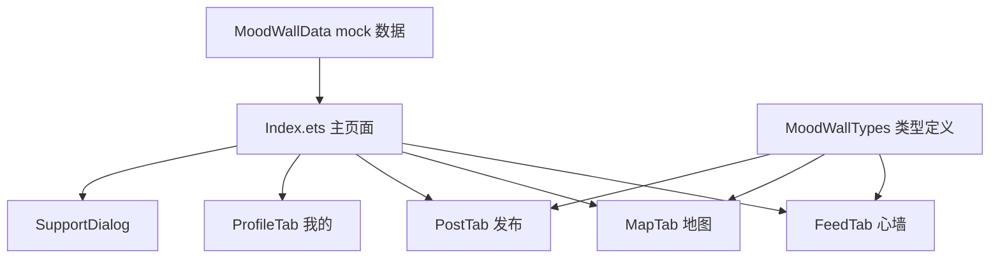

# MoodWalls

面向校园场景的 **情绪心墙** 应用。同学们可以匿名记录当下心情、浏览校园情绪动态、按区域查看「情绪气候」，并在发布后收到温和的陪伴式反馈。当前版本以本地 Mock 数据为主，适合作为 HarmonyOS / ArkUI 界面原型与课程、竞赛演示项目。

---

## 功能概览

| 模块 | 说明 |
|------|------|
| **心墙（Feed）** | 浏览情绪便签流，按心情标签筛选，点赞与「回信」式支持弹窗 |
| **地图（Map）** | 展示图书馆、生活区、湖畔等校园区域的「情绪气候」卡片 |
| **发布（Post）** | 选择 8 种情绪标签、填写内容、选择地点后发布到心墙 |
| **我的（Profile）** | 情绪占比统计、一周心情概览，可打开周报式支持文案 |

### 情绪标签

开心、平静、感动、疲惫、焦虑、低落、生气、孤单 —— 每种标签配有独立配色与发布提示语。

### 其他体验

- 根据时段显示问候语（凌晨好 / 早上好 / 中午好 / 下午好 / 晚上好）
- 顶栏展示焦虑、平静、开心三类情绪的占比摘要
- 发布成功后自动弹出 `SupportDialog` 陪伴文案

---

## 技术栈

| 项目 | 说明 |
|------|------|
| 平台 | HarmonyOS（`runtimeOS: HarmonyOS`） |
| 语言 | ArkTS |
| UI | ArkUI 声明式组件（`@Entry` / `@Component` / `@State` / `@Link`） |
| 构建 | Hvigor |
| SDK | API 6.1.0(23)（见 `build-profile.json5`） |
| 测试 | [@ohos/hypium](https://gitee.com/openharmony/testfwk_arkxtest)（单元测试框架） |

---

## 环境要求

- [DevEco Studio](https://developer.huawei.com/consumer/cn/deveco-studio/)（推荐 5.x 及以上，需支持 API 6.1）
- HarmonyOS SDK **6.1.0(23)**
- 真机或模拟器：设备类型为 **phone**（见 `entry/src/main/module.json5`）

---

## 快速开始

1. 克隆仓库到本地：

   ```bash
   git clone <你的仓库地址>
   cd MoodWalls
   ```

2. 使用 DevEco Studio 打开项目根目录（包含 `build-profile.json5` 的目录）。

3. 等待依赖同步完成（`ohpm` 会根据 `oh-package.json5` 拉取 `@ohos/hypium` 等开发依赖）。

4. 连接 HarmonyOS 设备或启动模拟器，选择 **entry** 模块，点击 **Run** 构建并安装 HAP。

5. 应用入口为 `EntryAbility`，首屏加载 `pages/Index`。

> **说明**：首次构建会在 `entry/build`、`.hvigor` 等目录生成产物，这些路径已在 `.gitignore` 中忽略，无需提交到 Git。

---

## 项目结构

```
MoodWalls/
├── AppScope/                          # 应用级配置与全局资源
│   ├── app.json5                      # bundleName、版本号、图标等
│   └── resources/
│       └── base/
│           ├── element/string.json    # 应用名称等资源
│           └── media/                 # 应用图标等
│
├── entry/                             # 主功能模块（HAP 入口）
│   ├── src/main/
│   │   ├── ets/
│   │   │   ├── entryability/
│   │   │   │   └── EntryAbility.ets   # UIAbility：窗口创建、加载 Index 页
│   │   │   ├── entrybackupability/
│   │   │   │   └── EntryBackupAbility.ets
│   │   │   ├── pages/
│   │   │   │   └── Index.ets          # 主页面：Tab 路由与全局状态
│   │   │   ├── tabs/
│   │   │   │   ├── FeedTab.ets        # 心墙列表
│   │   │   │   ├── MapTab.ets         # 校园情绪地图
│   │   │   │   ├── PostTab.ets        # 发布心情
│   │   │   │   └── ProfileTab.ets     # 个人情绪统计
│   │   │   ├── components/
│   │   │   │   ├── MoodWallHeader.ets # 顶栏问候与情绪占比
│   │   │   │   ├── MoodWallTabBar.ets # 底部导航
│   │   │   │   └── SupportDialog.ets  # 支持/周报弹窗
│   │   │   ├── model/
│   │   │   │   └── MoodWallTypes.ets  # NoteItem、MoodOption、ZoneCard 类型
│   │   │   └── mock/
│   │   │       └── MoodWallData.ets   # 初始便签、地点、区域、情绪配置
│   │   ├── module.json5               # 模块能力、页面路由、设备类型
│   │   └── resources/
│   │       └── base/
│   │           ├── element/           # 颜色、字符串
│   │           ├── media/             # 启动图、模块图标
│   │           └── profile/
│   │               └── main_pages.json
│   ├── src/ohosTest/                  # 仪器化测试
│   ├── src/test/                      # 本地单元测试
│   ├── build-profile.json5
│   ├── hvigorfile.ts
│   └── oh-package.json5
│
├── build-profile.json5                # 工程级构建与 SDK 版本
├── hvigorfile.ts                      # 工程 Hvigor 插件入口
├── oh-package.json5                   # 工程依赖（ohpm）
├── code-linter.json5                  # 代码检查配置（如有）
└── README.md                          # 本文件
```

### 核心数据流（简化）



- **状态中心**：`Index.ets` 持有 `notes`、`currentTab`、`filterMood` 等 `@State`，通过 `@Link` 与子 Tab 双向绑定。
- **数据来源**：`INITIAL_NOTES` 与区域卡片来自 `mock/MoodWallData.ets`；发布新便签仅追加到内存数组，暂无后端持久化。

---

## 模块说明

### `AppScope`

应用全局命名空间：`bundleName` 为 `com.example.moodwalls`，显示名称为 **MoodWalls**（`AppScope/resources/base/element/string.json`）。

### `entry`

唯一业务模块，类型为 `entry`，主 Ability 为 `EntryAbility`，页面注册在 `main_pages.json` 中仅包含 `pages/Index`。

| 目录 | 职责 |
|------|------|
| `pages/` | 单页多 Tab 壳层，不采用多 Page 路由 |
| `tabs/` | 四个 Tab 的 UI 与交互 |
| `components/` | 可复用头部、底栏、弹窗 |
| `model/` | 共享 TypeScript 风格接口 |
| `mock/` | 演示数据；后续可替换为网络层 Repository |

---

## 测试

工程已集成 Hypium，测试入口示例：

- 单元测试：`entry/src/test/`
- 仪器化测试：`entry/src/ohosTest/`

在 DevEco Studio 中可对对应测试模块执行 **Run 'Tests'**。

---

## 配置与构建要点

| 文件 | 作用 |
|------|------|
| `build-profile.json5` | `targetSdkVersion` / `compatibleSdkVersion`：6.1.0(23) |
| `entry/src/main/module.json5` | 声明 `phone` 设备、Ability、备份扩展能力 |
| `oh-package.json5` | `modelVersion: 6.1.0`，开发依赖 hypium / hamock |

签名配置在 `build-profile.json5` 的 `signingConfigs` 中为空数组，正式发布前需在 DevEco 中配置签名证书。

---

## 后续可扩展方向

- [ ] 接入后端 API：用户鉴权、便签 CRUD、点赞同步
- [ ] 使用 `@ohos.data.relationalStore` 或 Preferences 做本地缓存
- [ ] 地图 Tab 对接真实校园 POI / 热力图数据
- [ ] 完善 `EntryAbility_label` 等资源文案与无障碍
- [ ] 补充应用截图与演示 GIF 到本 README

---

## 贡献

欢迎通过 Issue / Pull Request 提交问题与改进。提交前请确保：

- 不提交 `build/`、`.hvigor/`、`oh_modules/` 等已忽略目录
- 新增页面需在 `main_pages.json` 与 `module.json5` 中同步注册

---

## 许可证

仓库尚未包含 `LICENSE` 文件。若你计划开源，请自行添加许可证（例如 Apache-2.0）并更新本节说明。

---

## 相关链接

- [HarmonyOS 应用开发文档](https://developer.huawei.com/consumer/cn/doc/harmonyos-guides/application-dev-guide)
- [ArkTS 语言指南](https://developer.huawei.com/consumer/cn/doc/harmonyos-guides/arkts-get-started)
- [ArkUI 声明式开发](https://developer.huawei.com/consumer/cn/doc/harmonyos-guides/arkui-overview)
