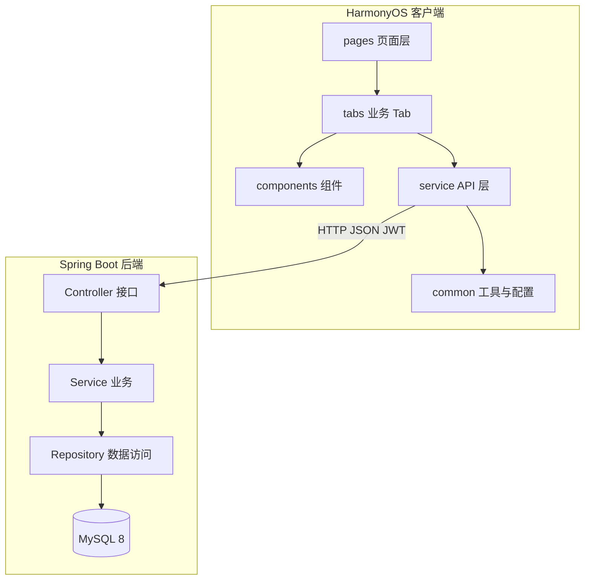
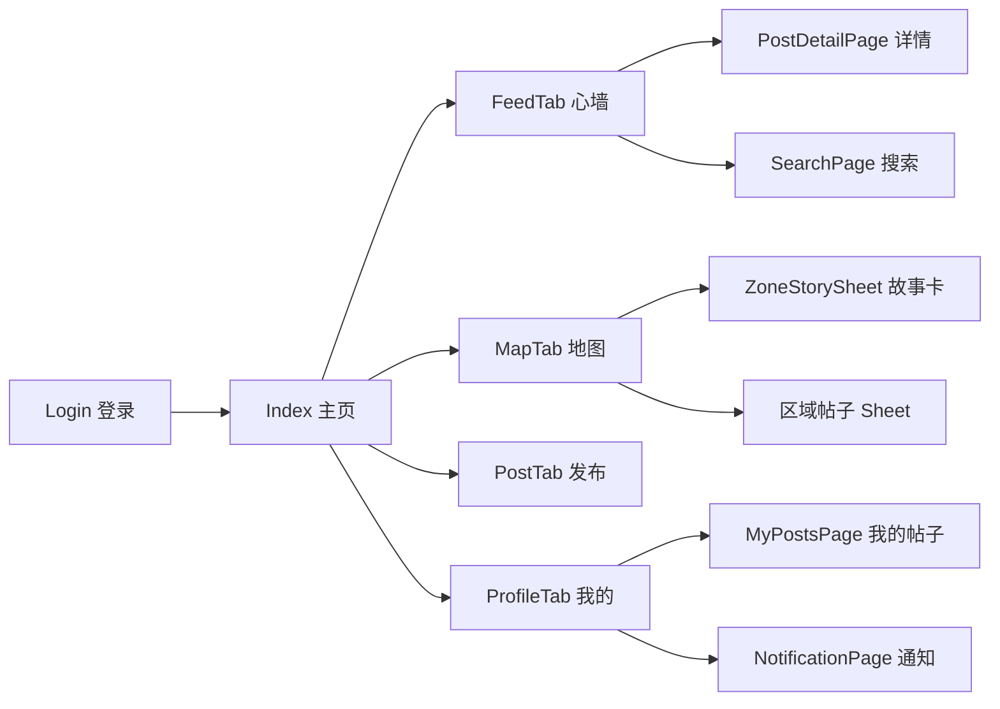

# **课程项目报告**

**项目名称：** MoodWalls 校园心灵墙  
**开发平台：** HarmonyOS NEXT · ArkTS · ArkUI  
**后端技术：** Spring Boot 3.2 · MySQL 8 · JWT  
**文档依据：** `PRD.md`、`PRD-二次开发.md`、`PRD-终期开发.md`

---

## **一、目的**

本课程项目旨在掌握 **鸿蒙移动应用（HarmonyOS）** 的完整开发流程，包括：

1. 使用 **ArkTS + ArkUI 声明式 UI** 构建多 Tab 移动应用界面；
2. 通过 **HTTP 网络层** 与 **Spring Boot 后端** 进行前后端分离联调；
3. 运用 **JWT 鉴权、MySQL 持久化、JPA 数据访问** 完成业务闭环；
4. 围绕校园情绪表达场景，设计并实现一套具有 **人文关怀温度** 的移动应用。

项目最终交付物为可在真机/模拟器运行的鸿蒙 HAP 应用，配套可局域网访问的后端 API 服务，以及完整的需求与开发文档。

---

## **二、需求分析**

### 2.1 项目背景与定位

MoodWalls（校园心灵墙）面向高校学生群体，提供 **匿名、温和、低压力** 的情绪记录与互动空间。与常规社交 App 不同，本产品强调：

- **看见情绪**：心墙 Feed、校园地图、情绪统计与曲线；
- **接住情绪**：AI 陪伴回信、「接住心声」、情绪反应（抱抱/懂你等）；
- **陪伴情绪**：悄悄话、送一朵云、陌生人小纸条、通知与周报。

### 2.2 用户角色与核心场景

| 角色 | 典型场景 |
|------|----------|
| 普通学生 | 登录后浏览心墙、按情绪筛选、对帖子表达反应、发帖记录心情 |
| 互动用户 | 进入帖子详情评论/悄悄话、长按送云、搜索共鸣内容 |
| 帖主 | 查看自己帖子收到的反应、悄悄话、云朵数；管理可见性与删帖 |
| 自我关怀 | 查看情绪日历、7 日曲线、抽取鼓励小纸条、阅读温情周报 |

### 2.3 功能需求清单

需求按开发阶段划分，均已在当前仓库中实现或部分实现。

#### 2.3.1 基础模块（PRD V2.0）

| 编号 | 功能 | 说明 |
|------|------|------|
| M01 | 用户认证 | 注册（图形验证码）、登录、JWT、个人资料修改 |
| M02 | 心情墙 Feed | 帖子列表、情绪筛选、分页、下拉刷新、点赞 |
| M03 | 发帖 | 8 种情绪、地点选择、AI 发帖回信 |
| M04 | AI 情感回信 | 发帖/接住心声时调用大模型生成陪伴文案 |
| M05 | 校园情绪地图 | 8 区域热点、24h 情绪气候、区域帖子列表 |
| M06 | 个人情绪档案 | 发帖/获赞/活跃天、情绪日历、心情分布、周报 |
| M07 | 通知系统 | 点赞/评论/悄悄话/送云等通知、未读角标 |

#### 2.3.2 体验增强（PRD-二次开发）

| 编号 | 功能 | 说明 |
|------|------|------|
| R01 | 本人帖子区分 | 左侧色条、背景色、显示「我」 |
| R02 | 微博式卡片 | `PostCard` 统一卡片、头像、操作栏 |
| R03 | 评论与回复 | 公开共鸣评论、楼中楼回复 |
| R04 | 删帖/仅自己可见 | 帖子可见性切换、删除 |
| R05 | 校园静态地图 | `CampusMapConfig` 热点坐标 + 底图 |
| R06 | 页面切换动画 | Tab 切换、路由 Push/Pop 过渡 |
| R07 | 关键字搜索 | 关键词 + 情绪 + 时段筛选 |

#### 2.3.3 人文关怀专项（PRD-终期开发）

| 编号 | 功能 | 说明 |
|------|------|------|
| D01 | 情绪反应 | 抱抱/懂你/加油/为你开心/陪你，单人单帖唯一 |
| D02 | 悄悄话评论 | 仅帖主可见的私密评论 Tab |
| D06 | 送一朵云 | 长按他人帖子送云，作者可见计数与通知 |
| H02 | 温柔危机关怀 | 后端关键词危机检测 + `isCrisis` 标记（AI 层） |
| H05 | 陌生人小纸条 | 独立纸条池，每日抽取鼓励语 |
| V02 | 区域情绪故事卡 | 点地图热点先看叙事故事再进帖子 |
| V03 | 情绪曲线图 | 近 7 日主导情绪 Canvas 曲线 |

### 2.4 非功能需求

| 类型 | 要求 |
|------|------|
| 性能 | 列表分页加载，首屏 20 条；地图/曲线接口响应 < 1s（局域网） |
| 安全 | 密码 BCrypt 存储；接口 JWT 鉴权；评论内容敏感词过滤 |
| 可用性 | 人文向文案；空状态引导；操作 Toast 反馈 |
| 可维护 | 前后端分层；SQL 迁移脚本；类型定义集中管理 |

> **【此处插入截图 1：应用整体四 Tab 主界面（心墙 / 地图 / 发布 / 我的）】**

---

## **三、总体设计**

### 3.1 系统架构

采用 **前后端分离 + RESTful API** 架构：



### 3.2 前端目录结构

| 目录 | 职责 | 代表文件 |
|------|------|----------|
| `entry/src/main/ets/pages/` | 路由页面 | `Index.ets`、`Login.ets`、`PostDetailPage.ets` |
| `entry/src/main/ets/tabs/` | 主 Tab 业务 | `FeedTab`、`MapTab`、`PostTab`、`ProfileTab` |
| `entry/src/main/ets/components/` | 可复用组件 | `PostCard`、`ReactionBar`、`MoodCurveChart` |
| `entry/src/main/ets/service/` | 网络 API | `HttpClient`、`PostApi`、`MoodApi` |
| `entry/src/main/ets/common/` | 工具/主题/会话 | `AuthSession`、`AppTheme`、`UiHelper` |
| `entry/src/main/ets/model/` | 类型定义 | `MoodWallTypes.ets` |
| `backend/src/main/java/com/moodwalls/` | 后端分层 | `controller` / `service` / `repository` / `entity` |

### 3.3 后端模块划分

| Controller | 职责 |
|------------|------|
| `AuthController` | 注册、登录、验证码、个人资料 |
| `PostController` | 帖子 CRUD、点赞、反应、送云、搜索 |
| `CommentController` | 评论列表、发表、删除 |
| `MapController` | 区域列表、区域故事、区域帖子 |
| `ProfileController` | 个人概览、日历、我的帖子、情绪曲线 |
| `InspirationController` | 小纸条写入、今日状态、每日抽取 |
| `NotificationController` | 通知列表、已读 |
| `SupportController` | 接住心声 AI 回信 |

### 3.4 数据库核心表

| 表名 | 用途 |
|------|------|
| `users` | 用户账号 |
| `posts` | 心情帖子 |
| `post_likes` / `post_reactions` | 点赞与情绪反应 |
| `post_comments` | 评论（含 whisper 类型） |
| `post_cloud_gifts` | 送云记录 |
| `encouragement_notes` / `inspiration_draws` | 小纸条池与抽取记录 |
| `campus_zones` | 校园区域配置 |
| `notifications` | 消息通知 |
| `ai_interactions` | AI 交互与危机标记 |

完整建表脚本：`backend/sql/init.sql`

### 3.5 界面导航结构



> **【此处插入截图 2：系统架构或导航关系示意（可用自绘或应用录屏拼图）】**

---

## **四、详细设计**

以下按功能模块说明 **设计思路、代码位置、核心逻辑**。每节标注截图插入位置。

---

### 4.1 用户认证模块（M01）

**设计要点：** 启动页为 `Login.ets`，已登录用户跳转 `Index.ets`；Token 与用户信息存入 `AuthSession`（Preferences）；所有需鉴权请求由 `HttpClient` 自动附加 `Authorization: Bearer`。

| 层级 | 路径 |
|------|------|
| 前端页面 | `entry/src/main/ets/pages/Login.ets`、`Register.ets` |
| 前端 API | `entry/src/main/ets/service/AuthApi.ets` |
| 会话管理 | `entry/src/main/ets/common/AuthSession.ets` |
| 后端 | `backend/.../controller/AuthController.java`、`service/AuthService.java` |

**核心代码（登录流程）：**

```typescript
// Login.ets
AuthApi.login(this.account.trim(), this.password).then((result: AuthResult) => {
  AuthSession.save(result.user, result.token)
  UiHelper.replaceTo('pages/Index')
})
```

```java
// AuthService.java — 校验密码并签发 JWT
User user = userRepository.findByPhoneOrNickname(account)
    .orElseThrow(() -> new BusinessException(401, "账号或密码错误"));
if (!passwordEncoder.matches(password, user.getPasswordHash())) {
    throw new BusinessException(401, "账号或密码错误");
}
return new AuthResponse(jwtTokenProvider.generateToken(user.getId()), toProfile(user));
```

> **【此处插入截图 3：登录页】**  
> **【此处插入截图 4：注册页】**

---

### 4.2 主框架与 Tab 路由（Index）

**设计要点：** `Index.ets` 作为单页多 Tab 壳层，持有全局 `@State`（帖子列表、筛选、发布草稿、支持弹窗等），通过 `@Link` 与子 Tab 共享状态；底部 `MoodWallTabBar` 切换四个 Tab。

| 层级 | 路径 |
|------|------|
| 主页面 | `entry/src/main/ets/pages/Index.ets` |
| 顶栏 | `entry/src/main/ets/components/MoodWallHeader.ets` |
| 底栏 | `entry/src/main/ets/components/MoodWallTabBar.ets` |
| AI 弹窗 | `entry/src/main/ets/components/SupportDialog.ets` |

**核心代码（Tab 分发）：**

```typescript
// Index.ets
if (this.currentTab === 0) {
  FeedTab({ notes: $notes, filterMood: this.filterMood, ... })
} else if (this.currentTab === 1) {
  MapTab({ onNavigateToPost: () => { this.currentTab = 2 } })
} else if (this.currentTab === 2) {
  PostTab({ selectedMoodKey: $selectedMoodKey, draftText: $draftText, ... })
} else {
  ProfileTab({ profileRefreshTick: this.profileRefreshTick, ... })
}
```

---

### 4.3 心情墙 Feed（M02 + R01/R02）

**设计要点：** `FeedTab` 展示 `PostCard` 列表，支持下拉刷新与上拉分页；顶栏可按 8 种情绪筛选；本人帖子通过 `isMine` 显示左侧强调色条。

| 层级 | 路径 |
|------|------|
| Tab | `entry/src/main/ets/tabs/FeedTab.ets` |
| 卡片组件 | `entry/src/main/ets/components/PostCard.ets` |
| API | `entry/src/main/ets/service/PostApi.ets` → `GET /api/posts` |
| 后端 | `PostService.java`、`PostController.java` |

**核心代码（分页加载）：**

```typescript
// Index.ets
PostApi.getPosts(this.currentPage, this.PAGE_SIZE, this.filterMood, token)
  .then((res) => {
    this.notes = reset ? res.list : this.notes.concat(res.list)
    this.hasMore = res.hasMore
  })
```

```java
// PostService.java — 公开 Feed 仅 visibility=1
Page<Post> postPage = "all".equals(mood)
    ? postRepository.findPublicFeed(pageable)
    : postRepository.findPublicFeedByMood(mood, pageable);
```

> **【此处插入截图 5：心墙 Feed 列表（含情绪筛选）】**  
> **【此处插入截图 6：本人帖子与他人帖子视觉区分】**

---

### 4.4 发帖与 AI 回信（M03 + M04）

**设计要点：** `PostTab` 支持「贴心情 / 写小纸条」双模式切换；发帖调用 `POST /api/posts`，后端 `AiService` 同步生成陪伴回信并在前端以 `SupportDialog` 展示。

| 层级 | 路径 |
|------|------|
| 发布 Tab | `entry/src/main/ets/tabs/PostTab.ets` |
| 情绪配置 | `entry/src/main/ets/mock/MoodWallData.ets`（`MOOD_OPTIONS`） |
| 后端发帖 | `PostService.createPost()`、`AiService.generateOnPublish()` |

**核心代码：**

```typescript
// PostTab.ets — 双模式切换
@State composeMode: string = 'post'  // 'post' | 'note'
```

```java
// AiService.java — 发帖时生成回信并检测危机关键词
String responseText = callAi(prompt);
boolean isCrisis = detectCrisis(responseText, post.getContent());
interaction.setIsCrisis(isCrisis ? 1 : 0);
return new AiResponse(responseText, isCrisis);
```

> **【此处插入截图 7：发帖页（情绪标签 + 正文）】**  
> **【此处插入截图 8：发帖成功后 AI 回信弹窗】**

---

### 4.5 情绪反应 D01

**设计要点：** 将单一「点赞」扩展为 5 种情感反应；同一用户对同一帖子仅保留一种反应，可切换或取消；`ReactionBar` 在卡片上展示 Top 反应与展开选择。

| 层级 | 路径 |
|------|------|
| 组件 | `entry/src/main/ets/components/ReactionBar.ets` |
| 配置 | `entry/src/main/ets/common/ReactionConfig.ets` |
| API | `PostApi.reactPost()` / `cancelReact()` |
| 后端 | `ReactionService.java`、`PostReaction` 实体 |
| 数据表 | `post_reactions` |

**核心代码：**

```typescript
// ReactionConfig.ets
export const REACTION_OPTIONS = [
  { type: 'hug', label: '抱抱', emoji: '🤗' },
  { type: 'understand', label: '懂你', emoji: '💭' },
  // ...
]
```

```java
// ReactionService.java — 单人单帖唯一，重复选择则切换类型
Optional<PostReaction> existing = reactionRepository.findByUserIdAndPostId(userId, postId);
if (existing.isPresent()) {
    reaction.setReactionType(reactionType);
} else {
    reactionRepository.save(newReaction);
}
```

> **【此处插入截图 9：帖子卡片上的情绪反应栏】**

---

### 4.6 帖子详情、评论与悄悄话 D02（R03）

**设计要点：** `PostDetailPage` 展示完整帖子与评论列表；评论分 **共鸣（公开）** 与 **悄悄话（仅帖主可见）** 两个 Tab；后端 `findVisibleTopComments` 按身份过滤 whisper。

| 层级 | 路径 |
|------|------|
| 详情页 | `entry/src/main/ets/pages/PostDetailPage.ets` |
| 评论 API | `entry/src/main/ets/service/CommentApi.ets` |
| 后端 | `CommentService.java`、`PostCommentRepository.java` |

**核心代码：**

```typescript
// PostDetailPage.ets
@State commentMode: string = 'resonance'  // 'resonance' | 'whisper'
const body: CreateCommentBody = {
  content: text,
  commentType: this.commentMode,
  parentId: this.replyTarget?.parentId
}
```

```sql
-- PostCommentRepository — 悄悄话仅帖主可见
-- viewer 为帖主 OR comment_type != 'whisper'
```

> **【此处插入截图 10：帖子详情页 — 公开评论 Tab】**  
> **【此处插入截图 11：悄悄话 Tab（帖主视角，带 🔒 样式）】**

---

### 4.7 送一朵云 D06

**设计要点：** 对他人帖子 **长按** 触发送云（无独立按钮）；前端 60 秒本地节流 + 后端持久化；作者在自己帖子上看到「收到 N 朵云」徽章，并收到 `cloud` 类型通知。

| 层级 | 路径 |
|------|------|
| 卡片交互 | `entry/src/main/ets/components/PostCard.ets`（`trySendCloud` + 长按） |
| 动画 | `entry/src/main/ets/components/CloudGiftAnimation.ets` |
| 节流 | `entry/src/main/ets/common/CloudGiftThrottle.ets` |
| API | `PostApi.sendCloud()` → `POST /api/posts/{id}/cloud` |
| 后端 | `CloudGiftService.java`、`NotificationService.notifyCloudGift()` |
| 数据表 | `post_cloud_gifts` |

**核心代码：**

```typescript
// PostCard.ets — 长按送云
.gesture(LongPressGesture().onAction(() => {
  if (!this.isMine()) { this.trySendCloud() }
}))
PostApi.sendCloud(this.note.id, token).then(() => {
  this.cloudVisible = true  // 播放 CloudGiftAnimation
})
```

```java
// CloudGiftService.java
cloudGiftRepository.save(gift);
notificationService.notifyCloudGift(post, userId);
```

> **【此处插入截图 12：送云动画（发送方）】**  
> **【此处插入截图 13：作者帖子「收到 N 朵云」徽章】**

---

### 4.8 关键字搜索 R07

**设计要点：** 独立搜索页，支持关键词、情绪、时段三维筛选；搜索历史本地持久化（`SearchHistoryStore`）。

| 层级 | 路径 |
|------|------|
| 页面 | `entry/src/main/ets/pages/SearchPage.ets` |
| 历史 | `entry/src/main/ets/common/SearchHistoryStore.ets` |
| API | `PostApi.searchPosts()` → `GET /api/posts/search` |

> **【此处插入截图 14：搜索页与筛选结果】**

---

### 4.9 校园情绪地图与区域故事卡 V02（M05）

**设计要点：** `MapTab` 展示校园底图与 8 个热点；点击热点 **先弹出 `ZoneStorySheet` 故事卡**（24h 叙事 + 情绪分布），用户再选择进入区域帖子或去发帖。

| 层级 | 路径 |
|------|------|
| 地图 Tab | `entry/src/main/ets/tabs/MapTab.ets` |
| 热点坐标 | `entry/src/main/ets/common/CampusMapConfig.ets` |
| 故事卡 | `entry/src/main/ets/components/ZoneStorySheet.ets` |
| API | `MoodApi.getZoneStory()` → `GET /api/map/zones/{key}/story` |
| 后端 | `MapStoryService.java`、`MapController.java` |

**核心代码：**

```typescript
// MapTab.ets — 点击热点先加载故事
openZoneStory(zone: MapZoneItem): void {
  this.showStorySheet = true
  MoodApi.getZoneStory(zone.key).then((story) => { this.zoneStory = story })
}
```

```java
// MapStoryService.java — 模板拼接叙事文案
if (postCount <= 0) {
    return "今天的" + title + "还很安静。如果你正好路过，可以留下第一张心情纸条。";
}
if ("anxious".equals(dominantMood)) {
    return "今天的" + title + "有些紧绷，" + postCount + " 位同学在这里留下了心情...";
}
```

> **【此处插入截图 15：校园情绪地图】**  
> **【此处插入截图 16：区域情绪故事卡（半屏 Sheet）】**  
> **【此处插入截图 17：区域帖子列表 Sheet】**

---

### 4.10 个人档案、情绪曲线 V03、小纸条 H05（M06）

**设计要点：**

- **ProfileTab**：个人概览、情绪日历、走过情绪（曲线/分布双 Tab）、小纸条抽取；
- **V03**：`MoodCurveChart` 用 Canvas 绘制近 7 日主导情绪曲线，无帖日断点；
- **H05**：`encouragement_notes` 独立纸条池，与帖子分离；每日限抽 1 次。

| 层级 | 路径 |
|------|------|
| 我的 Tab | `entry/src/main/ets/tabs/ProfileTab.ets` |
| 曲线图 | `entry/src/main/ets/components/MoodCurveChart.ets` |
| 小纸条卡 | `entry/src/main/ets/components/InspirationCard.ets` |
| 曲线 API | `ProfileApi.getMoodCurve()` → `GET /api/profile/mood-curve` |
| 小纸条 API | `InspirationApi.ets` → `/api/inspiration/*` |
| 后端 | `MoodCurveService.java`、`InspirationService.java`、`EncouragementNoteService.java` |

**核心代码（情绪曲线）：**

```java
// MoodCurveService.java — 按日聚合，取主导情绪
for (Object[] row : postRepository.countUserMoodByDateSince(userId, since)) {
    dailyMoodCounts.computeIfAbsent(date, k -> new HashMap<>()).merge(mood, count, Long::sum);
}
String dominantMood = dayTotal > 0 ? MoodHelper.pickDominantMood(moodCounts) : null;
```

```typescript
// MoodCurveChart.ets — 无数据日断开连线
if (this.hasData(this.points[i])) { current.push(i) }
else if (current.length > 0) { segments.push(current); current = [] }
```

**核心代码（小纸条）：**

```typescript
// PostTab.ets + Index.ets — 写小纸条入池
InspirationApi.createNote({ content, mood }, token)
InspirationApi.draw(token)  // ProfileTab 每日抽取
```

> **【此处插入截图 18：我的页个人概览与情绪日历】**  
> **【此处插入截图 19：7 日情绪曲线图】**  
> **【此处插入截图 20：情绪分布进度条 Tab】**  
> **【此处插入截图 21：陌生人小纸条抽取卡片】**

---

### 4.11 通知系统 M07

**设计要点：** 顶栏与个人页展示未读角标；`NotificationPage` 分类展示点赞、评论、悄悄话、送云等通知，点击跳转帖子详情。

| 层级 | 路径 |
|------|------|
| 通知页 | `entry/src/main/ets/pages/NotificationPage.ets` |
| 角标 | `entry/src/main/ets/common/NotificationStore.ets` |
| API | `MoodApi.getNotifications()` |
| 后端 | `NotificationService.java` |

> **【此处插入截图 22：通知列表（含悄悄话/送云类型标签）】**

---

### 4.12 其他增强功能

| 功能 | 代码位置 | 说明 |
|------|----------|------|
| 我的帖子 | `pages/MyPostsPage.ets` | 删帖、可见性切换 |
| 接住心声 | `MoodApi.supportPost()` | 对他人帖子请求 AI 陪伴回信 |
| 深色模式 | `ProfileTab` + `AppTheme` | `themeMode` 全局 StorageLink |
| 页面动画 | `UiHelper` + 各页 `pageTransition` | Tab 与路由过渡 |
| 帖子管理 | `common/PostActionHelper.ets` | 删帖/私密弹窗复用 |
| 危机检测 H02 | `AiService.detectCrisis()` | 关键词检测，结果写入 `ai_interactions.is_crisis` |

---

## **五、技术实现**

### 5.1 技术选型

| 层次 | 技术 | 版本/说明 |
|------|------|-----------|
| 客户端 OS | HarmonyOS | API 6.1.0(23) |
| 客户端语言 | ArkTS | 声明式 UI |
| 网络 | `@kit.NetworkKit` | 封装于 `HttpClient.ets` |
| 服务端 | Spring Boot | 3.2 |
| ORM | Spring Data JPA | `ddl-auto: update` |
| 数据库 | MySQL | 8.x |
| 鉴权 | JWT + BCrypt | `JwtTokenProvider` |
| AI | 硅基流动 OpenAPI | Qwen2.5-7B-Instruct（可配置） |

### 5.2 网络通信规范

- **Base URL：** `http://<局域网IP>:8080/api`（配置于 `ApiConfig.local.ets`）
- **请求头：** `Authorization: Bearer <token>`
- **响应格式：** `{ code, message, data }`，`HttpClient` 统一解包与错误抛出

```typescript
// HttpClient.ets
if (token !== undefined && token.length > 0) {
  headers = { 'Content-Type': 'application/json', 'Authorization': `Bearer ${token}` }
}
```

### 5.3 状态管理策略

| 场景 | 方案 |
|------|------|
| 页面内 UI 状态 | `@State` |
| 父子组件共享 | `@Prop` / `@Link` |
| 跨页面轻量共享 | `AppStorage` / `@StorageLink`（主题、未读数） |
| 登录会话 | `AuthSession`（Preferences 持久化） |
| 列表数据 | `Index.notes` 中心化，Feed/搜索各自维护副本 |

### 5.4 数据库与迁移

- 初始化：`backend/sql/init.sql`
- 增量迁移：`backend/sql/migrations/V3_*.sql`（评论、反应、小纸条、送云等）
- 关键约束：`post_reactions (user_id, post_id)` 唯一；`post_cloud_gifts` 索引支持冷却查询

### 5.5 部署与联调步骤

1. MySQL 执行 `init.sql` 及 migrations；
2. 配置 `backend/src/main/resources/application-local.yml`；
3. `mvn spring-boot:run` 启动后端（`0.0.0.0:8080`）；
4. 复制 `ApiConfig.local.example.ets` 为 `ApiConfig.local.ets`，填入电脑局域网 IP；
5. DevEco Studio 编译运行 `entry` 模块至真机/模拟器。

详细说明见 `docs/本地配置注意事项.md`、`backend/README.md`。

### 5.6 关键接口汇总

| 方法 | 路径 | 功能 |
|------|------|------|
| POST | `/api/auth/login` | 登录 |
| GET | `/api/posts` | 心墙列表 |
| POST | `/api/posts` | 发帖 |
| POST | `/api/posts/{id}/react` | 情绪反应 |
| POST | `/api/posts/{id}/cloud` | 送云 |
| GET/POST | `/api/posts/{id}/comments` | 评论/悄悄话 |
| GET | `/api/posts/search` | 搜索 |
| GET | `/api/map/zones/{key}/story` | 区域故事 V02 |
| GET | `/api/profile/mood-curve` | 情绪曲线 V03 |
| POST | `/api/inspiration/draw` | 抽取小纸条 H05 |
| GET | `/api/notifications` | 通知列表 |

---

## **六、项目总结**

### 6.1 完成情况

本项目从 **鸿蒙 UI 原型** 起步，历经 **V2.0 基础联调**、**二次开发体验增强**、**终期人文关怀专项** 三个阶段，最终形成一套可演示、可答辩、功能完整的校园情绪应用：

- **前端：** 10+ 页面、15+ 业务组件、6 个 API 服务模块，覆盖四 Tab 主流程及详情/搜索/通知等子页面；
- **后端：** 8 个 Controller、15+ Service，20+ 数据表/实体，REST 接口与 JWT 鉴权完备；
- **特色：** 情绪反应、悄悄话、送云、区域故事、情绪曲线、陌生人小纸条等差异化功能，体现「看见—接住—陪伴」的产品叙事。

### 6.2 收获与体会

1. **鸿蒙开发：** 掌握了 ArkUI 声明式布局、`@State/@Link` 状态机制、Canvas 绑图、路由与页面过渡；
2. **前后端协作：** 通过统一 `ApiResponse` 与 TypeScript 类型定义，降低联调成本；
3. **产品设计：** 在技术实现中融入人文关怀文案与交互细节，使应用区别于普通论坛类产品；
4. **工程规范：** SQL 版本化、配置与密钥分离（`.gitignore`）、分层架构便于迭代。

### 6.3 不足与展望

| 不足 | 后续改进 |
|------|----------|
| 危机关怀前端专层（`CrisisCareSheet`）未完全独立 | 根据 `isCrisis` 展示援助资源弹层 |
| 离线缓存较弱 | 引入 RelationalStore 缓存 Feed |
| AI 依赖外网 API | 增加本地兜底文案策略 |
| 地图为静态示意图 | 可对接真实 POI 或热力图层 |

### 6.4 截图清单（提交前核对）

| 序号 | 建议截图内容 | 对应章节 |
|------|--------------|----------|
| 1 | 四 Tab 主界面 | §2.4 |
| 2 | 架构/导航示意 | §3.5 |
| 3–4 | 登录、注册 | §4.1 |
| 5–6 | 心墙列表、本人帖区分 | §4.3 |
| 7–8 | 发帖页、AI 回信 | §4.4 |
| 9 | 情绪反应 | §4.5 |
| 10–11 | 详情评论、悄悄话 | §4.6 |
| 12–13 | 送云动画、收到云徽章 | §4.7 |
| 14 | 搜索 | §4.8 |
| 15–17 | 地图、故事卡、区域帖 | §4.9 |
| 18–21 | 我的页、曲线、分布、小纸条 | §4.10 |
| 22 | 通知列表 | §4.11 |

---

**附录：主要参考文档**

| 文档 | 路径 |
|------|------|
| 产品需求 V2.0 | `PRD.md` |
| 二次开发需求 | `PRD-二次开发.md` |
| 终期人文关怀专项 | `PRD-终期开发.md` |
| 项目说明 | `README.md` |
| 本地配置 | `docs/本地配置注意事项.md` |
| 后端 API | `backend/README.md` |
